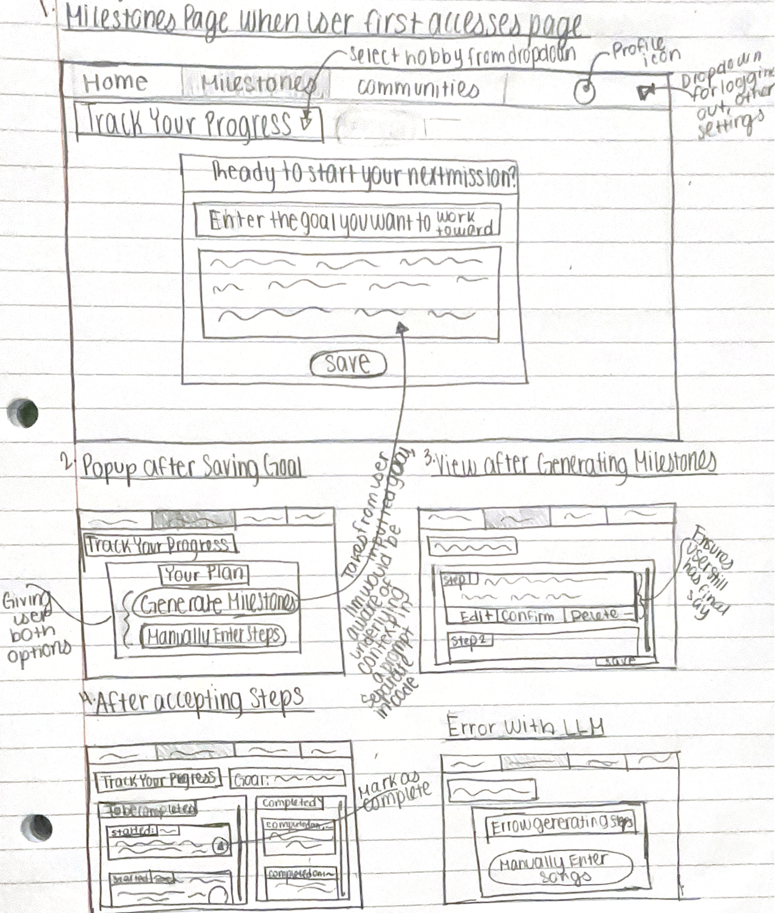

# HobbySprout 
[6.104 Portfolio](https://github.com/gloriapul/61040-portfolio)

A hobby motivation tool. This implementation focuses on the core concept of breaking down one's hobbies into smaller and more manageable tasks. 

## Concept: Milestones[User, Hobby]

### Original
> purpose allow users to monitor the progress that they are making toward their goals\
> principle after a user inputs their goals, they will see a set of steps they are yet to complete and those that they have completed\
> state\
> a set of goals Strings\
> a set of steps Strings with
>> a description String\
>> a start Date
>> a completion Date\
>> a status String
>> an activity status Boolean

> actions\
> addGoal (goal: String): (goals: Strings)
>> requires goal is not already in set of goals\
>> effects adds goal to set of goals

> completeStep (step: String): (steps: Strings)
>> requires step has an in process status\
>> effects marks step as a status complete, records completion date\
>> if all steps are complete, mark Milestones as inactive

> closeMilestones ()
>> requires Milestones to be active\
>> effects marks Milestones as inactive

### AI-augmented Version
> purpose allow users to monitor the progress that they are making toward their goals\
> principle after a user inputs their goal, they will have the option of having an llm generate their list of recommended steps or will be able to input their own, then being allowed to see those that they have yet to complete and those that have been completed\
> state\
> a goal String\
> a set of steps Strings with
>> a description String\
>> a start Date\
>> a completion Date\
>> a isComplete status Boolean

> actions\
> setGoal (goal: String): (goal: String)
>> requires goal to not already exist
>> effects sets goal to inputted goal

> async generateSteps (llm: GeminiLLM, goal: String) : (steps: Strings)
>> requires goal is not an empty string\
>> effects sets steps to set of steps outputted from an llm

> setSteps (step: String) : (steps: Strings)
>> requires goal is not an empty string\
>> effects adds step inputted by user to set of steps

> completeStep (step: String): (steps: Strings)
>> requires step is not completed\
>> effects marks step as a status complete, records completion date\
>> if all steps are complete, mark Milestones as inactive

> closeMilestones ()
>> requires Milestones to be active\
>> effects marks Milestones as inactive

## User Interaction

### Sketches


### User Journey

A user is ready to start working on their hobby, knitting. They make their way to the milestones page and are greeted by the popup telling them they must enter their goal. They input their goal of wanting to work toward knitting a set of clothes, including a hat and sweater, for the winter season and save it, which prompts them to the next popup. They must decide between having an llm generate their recommended plan based on their goal or adding in their own steps. They decide to opt for the llm as it will save them time from having to manually enter everything. Once their plan is generated, they see a set of 10 steps that include reviewing tutorials, purchasing items and more. They decide that they do not need 10 steps for this. They delete one of the steps and edit another, deciding that it needs to be more specific. Once they have reviewed all of the steps, they confirm each and save the plan. From there, they are now able to see their in progress steps and those that have been completed, which that would be 0 since they are just starting. 

## Test cases and Prompts
Apart from a test case that manually adds steps for a knitting goal and one that tested validation of goals and steps, I added in 3 test cases that use the llm generated steps. I took three different angles with these goals. All three test cases involve the same base user actions of deciding to get the llm to generate the steps for them. The last test case had an extra user action of a user deciding to add another step manually. My prompt initially was:

```
    Create a structured step-by-step plan for this goal: "${this.goal}"

    Response Requirements:
    1. Return ONLY a single-line JSON array of strings
    2. Steps must be in logical order
    3. Do NOT use line breaks or extra whitespace
    4. Properly escape any quotes in the text
    5. No step numbers or prefixes
    6. No comments or explanations

    Return ONLY the JSON array, nothing else.`
```

### 1. Photography 
```typescript
const milestone = new Milestones();
const goal = milestone.setGoal('Learn photography basics, I have an event to photograph in 2 days. I do not own a camera and am colorblind');
```

This test case presents a goal with a tight deadline and some added challenges, including not already having a camera and being colorblind. Once I knew the angle I wanted to take with this goal, I experimented with the prompt as I had it. I found that it missed the point of the user's goal. It had some unrelated steps without a clear mission, which added clutter to the user's plan. I decided to experiment by adding to the list of rules two statements that would address that issue of remaining relevant and also being realistic. Since the user's goal specifies that they only have 2 days, the llm must have a realistic response. My approach of adding these statements improved the test response greatly, but the issue still remained of not having too many smaller unneccessary steps, which I addressed with the third test case.  

```
2. Each string should be a specific, complete, measurable, and actionable step
3. Step must be relevant to the goal and feasible for an average person, should not be overly ambitious or vague
```

### 2. Cooking
```typescript
const milestone = new Milestones();
const goal = milestone.setGoal('Learn how to cook');
```

When testing out this goal, which was more on the vague side, I was surprised by how the output went wrong. It had different assumptions for what the user wanted and in different iterations, it assumed that the user was looking to learn how to cook for a job. It was interesting to see the variations, and the wide range of responses prompted me to add to the prompt some context for the llm. The statement was designed to make it clear why llm is doing what it is doing. This improved the responses greatly and despite the goal being very vague, it was helpful. An issue, similar to the first test case, still remained with the number of steps. Since this was did not have a timeframe provided, it went far with the number of steps. 

```
You are a helpful AI assistant that creates a recommended plan of clear steps for people looking to work on a hobby.

```

### 3. Podcasts
```typescript
const milestone = new Milestones();
const goal = milestone.setGoal('Learn how to make a 1 hour podcast. I want to understand the entire process from planning, recording, editing, and publishing. I am aiming to change the world and solve crises with this podcast.');
```

With this test case, I decided to take an approach of a goal that is more detailed and also more ambitious. The addition of the statements that I experimented with in the first two test cases were helpful for producing a better ouput from the llm. To address the issue of the number of steps, I experimented with another statement. I decided on it after tweaking it a bit since it was important that it was mindful of the number of steps generated, but also specifying that the steps generated must be necessary. That helped avoid it excluding important steps and then including basic unimportant steps. My qualitative assessment of the responses led me to deciding on the statement below. I also decided to add the example response format after seeing an error with the llm parsing at one point. An issue that remains is enforcing the formatting as it would every so often throw an error due to the formatting of the llm's response. That is something I will continue to explore. 

```
4. Only contain necessary steps to achieve the goal, avoid filler steps and be mindful of number of steps generated

Example response format:
        ["Research camera settings and features","Practice taking photos in different lighting","Review and organize test shots"]
```
## Validators

1. Duplicate steps
2. Unrelated/hallucinated steps
3. Overlay unclear/vague steps

## Prerequisites

- **Node.js** (version 14 or higher)
- **TypeScript** (will be installed automatically)
- **Google Gemini API Key** (free at [Google AI Studio](https://makersuite.google.com/app/apikey))

## Quick Setup

### 0. Clone the repo locally and navigate to it
```cd intro-gemini-schedule```

### 1. Install Dependencies

```bash
npm install
```

### 2. Add Your API Key

**Why use a template?** The `config.json` file contains your private API key and should never be committed to version control. The template approach lets you:
- Keep the template file in git (safe to share)
- Create your own `config.json` locally (keeps your API key private)
- Easily set up the project on any machine

**Step 1:** Copy the template file:
```bash
cp config.json.template config.json
```

**Step 2:** Edit `config.json` and add your API key:
```json
{
  "apiKey": "YOUR_GEMINI_API_KEY_HERE"
}
```

**To get your API key:**
1. Go to [Google AI Studio](https://makersuite.google.com/app/apikey)
2. Sign in with your Google account
3. Click "Create API Key"
4. Copy the key and paste it into `config.json` (replacing `YOUR_GEMINI_API_KEY_HERE`)

### 3. Run the Application

**Run all test cases:**
```bash
npm start
```

**Run specific test cases:**
```bash
npm run manual    # Manual scheduling only
npm run llm       # LLM-assisted scheduling only
npm run mixed     # Mixed manual + LLM scheduling
```

## File Structure

```
milestones/
├── package.json              # Dependencies and scripts
├── tsconfig.json             # TypeScript configuration
├── config.json               # Your Gemini API key
├── milestones.ts             # Milestones class implementation
├── gemini-llm.ts             # LLM integration
├── milestones-tests.ts       # Test cases and examples
├── dist/                     # Compiled JavaScript output
└── README.md                 # This file
```

## Sample Output

```📝 Setting up milestone...
Goal set: Learn how to make a 1 hour podcast. I want to understand the entire process from planning, recording, editing, and publishing. I am aiming to change the world with this podcast.

🤖 Generating steps using LLM...

📋 Generated steps:
- Define your podcast's core message and target audience for world-changing impact (started: 10/5/2025, to be completed)
- Outline the structure and content for a 1-hour episode, including segments and talking points (started: 10/5/2025, to be completed)
- Research and select suitable recording equipment (microphone, headphones, software) within a budget (started: 10/5/2025, to be completed)
- Practice recording voice samples to assess audio quality and familiarize yourself with equipment (started: 10/5/2025, to be completed)
- Learn basic audio editing techniques using free or affordable software (e.g., Audacity, GarageBand) (started: 10/5/2025, to be completed)
- Edit your first 1-hour podcast episode, focusing on clarity, flow, and removing mistakes (started: 10/5/2025, to be completed)
- Create compelling cover art and write a descriptive podcast title and summary (started: 10/5/2025, to be completed)
- Research and choose a podcast hosting platform (e.g., Anchor, Buzzsprout, Libsyn) (started: 10/5/2025, to be completed)
- Upload and publish your completed 1-hour podcast episode to your chosen hosting platform (started: 10/5/2025, to be completed)
- Develop a promotion strategy to share your podcast and reach a wider audience for world-changing impact (started: 10/5/2025, to be completed)

📝 Adding one more step manually...

📋 Updated steps:
- Define your podcast's core message and target audience for world-changing impact (started: 10/5/2025, to be completed)
- Outline the structure and content for a 1-hour episode, including segments and talking points (started: 10/5/2025, to be completed)
- Research and select suitable recording equipment (microphone, headphones, software) within a budget (started: 10/5/2025, to be completed)
- Practice recording voice samples to assess audio quality and familiarize yourself with equipment (started: 10/5/2025, to be completed)
- Learn basic audio editing techniques using free or affordable software (e.g., Audacity, GarageBand) (started: 10/5/2025, to be completed)
- Edit your first 1-hour podcast episode, focusing on clarity, flow, and removing mistakes (started: 10/5/2025, to be completed)
- Create compelling cover art and write a descriptive podcast title and summary (started: 10/5/2025, to be completed)
- Research and choose a podcast hosting platform (e.g., Anchor, Buzzsprout, Libsyn) (started: 10/5/2025, to be completed)
- Upload and publish your completed 1-hour podcast episode to your chosen hosting platform (started: 10/5/2025, to be completed)
- Develop a promotion strategy to share your podcast and reach a wider audience for world-changing impact (started: 10/5/2025, to be completed)
- Start a podcasting business (started: 10/5/2025, to be completed)

✅ Completing all steps...

📋 Milestone status now that all steps were completed...
Active: false
```

## Troubleshooting

### "Could not load config.json"
- Ensure `config.json` exists with your API key
- Check JSON format is correct

### "Error calling Gemini API"
- Verify API key is correct
- Check internet connection
- Ensure API access is enabled in Google AI Studio

### Build Issues
- Use `npm run build` to compile TypeScript
- Check that all dependencies are installed with `npm install`

## Resources

- [Google Generative AI Documentation](https://ai.google.dev/docs)
- [TypeScript Documentation](https://www.typescriptlang.org/docs/)
